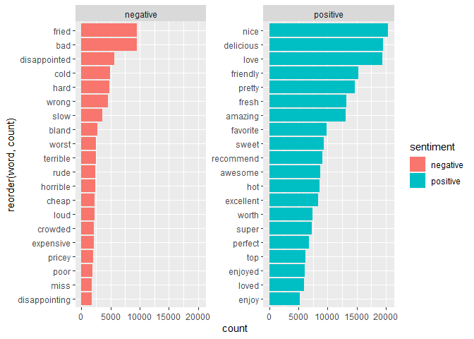

Lab 3: Text mining and sentiment analysis
================

## Text mining

In the second half of this lab, you’ll do some basic text mining and
sentiment analysis using data from the [Yelp data
challenge](https://www.yelp.com/dataset/challenge/winners).
Specifically, you’ll be looking at reviews for businesses in Charlotte,
NC. This file is available in the data folder of this lab repo.

**IMPORTANT**: Yelp has some restrictions on these data, primarily that
it cannot be shared publicly or used for publication/analysis. You are
free to use it for this lab or for personal research, but you cannot
reuse it for other public facing projects. Yelp now has a public version
of their data available at [this link](https://www.yelp.com/dataset).

``` r
library(tidyverse)
```

    ## -- Attaching packages ------------------------------------- tidyverse 1.3.0 --

    ## v ggplot2 3.3.2     v purrr   0.3.4
    ## v tibble  3.0.3     v dplyr   1.0.2
    ## v tidyr   1.1.2     v stringr 1.4.0
    ## v readr   1.3.1     v forcats 0.5.0

    ## -- Conflicts ---------------------------------------- tidyverse_conflicts() --
    ## x dplyr::filter() masks stats::filter()
    ## x dplyr::lag()    masks stats::lag()

``` r
#install.packages("tidytext")
library(tidytext)
library(knitr)
#install.packages("gutenbergr")
library(gutenbergr)

yelp_data<-read_csv("data/charlotte_restaurants.csv")
```

    ## Parsed with column specification:
    ## cols(
    ##   .default = col_double(),
    ##   business_id = col_character(),
    ##   review_id = col_character(),
    ##   date = col_datetime(format = ""),
    ##   name = col_character(),
    ##   address = col_character(),
    ##   text = col_character()
    ## )

    ## See spec(...) for full column specifications.

These data include multiple variables about businesses listed in Yelp.
In this case, only restaurants are included, and there are dummy
variables (0/1) for the 10 most common restaurant categories. Here’s a
list of them and the count of reviews in each:

``` r
rest_table<-yelp_data %>%
  pivot_longer(`American (New)`:Sandwiches,
               names_to="type",
               values_to="pres") %>%
  group_by(type) %>%
  summarise(count=sum(pres)) %>%
  arrange(-count)
```

    ## `summarise()` ungrouping output (override with `.groups` argument)

``` r
kable(rest_table)
```

| type                   | count |
| :--------------------- | ----: |
| Restaurants            | 99661 |
| Food                   | 34689 |
| Nightlife              | 30239 |
| Bars                   | 29092 |
| American (New)         | 21564 |
| American (Traditional) | 19791 |
| Breakfast & Brunch     | 17933 |
| Sandwiches             | 12865 |
| Pizza                  |  9940 |
| Burgers                |  9037 |
| Mexican                |  8836 |

**Question 1 (3 points)**: Identify the 20 most common words in these
reviews, first filtering out the stopwords using an anti\_join as shown
in the class script for text mining. You can use the top\_n function to
select the 20 most common words. Use the arrange function to order your
results from highest to lowest as shown in the table above. Use kable to
call the table with your results when done.

``` r
yelp_words<-yelp_data%>%
  unnest_tokens(word, text)

bing_sentiment<-get_sentiments("bing")
head(bing_sentiment)
```

    ## # A tibble: 6 x 2
    ##   word       sentiment
    ##   <chr>      <chr>    
    ## 1 2-faces    negative 
    ## 2 abnormal   negative 
    ## 3 abolish    negative 
    ## 4 abominable negative 
    ## 5 abominably negative 
    ## 6 abominate  negative

``` r
yelp_sentiment<-yelp_words%>%
  inner_join(bing_sentiment) %>% #This keeps only words in both lists
  anti_join(stop_words) %>%
  group_by(word,sentiment) %>%
  summarise(count=n())
```

    ## Joining, by = "word"
    ## Joining, by = "word"

    ## `summarise()` regrouping output by 'word' (override with `.groups` argument)

``` r
top_20<-yelp_sentiment%>%
  group_by(sentiment)%>%
  top_n(20)%>%
  arrange(-count)
```

    ## Selecting by count

``` r
kable(head(top_20))
```

| word      | sentiment | count |
| :-------- | :-------- | ----: |
| nice      | positive  | 20408 |
| delicious | positive  | 19528 |
| love      | positive  | 19431 |
| friendly  | positive  | 15244 |
| pretty    | positive  | 14727 |
| fresh     | positive  | 13250 |

**Question 2 (2 points)**: Using ggplot, create a bar plot showing the
frequency of these most common words. The class script on text mining
has an example of how to do this using geom\_col. Note that you’ll have
to use the reorder function (shown in the class script on text mining)
to order these bars from high to low values.

``` r
ggplot(top_20,aes(reorder(word,count), count, fill = sentiment)) + 
  geom_col()+
  facet_wrap(~sentiment,scales="free_y")+
  coord_flip()
```

<!-- -->

**Question 3 (5 points)**: Now let’s compare two types of restaurants.
Filter the dataset so you just have restaurants with *one* or *five*
stars based on reviews (see the “stars” variable). Using the same
process of question 1, identify the 20 most common words (not counting
stop words) in each type of review (one/five star). Use kable to call
the head of your table when done.

``` r
# 20 of 1 star reviews AND 20 of 5 star
rest_by_rating<-yelp_data%>%
  filter(stars == 1.0 | stars == 5.0)%>%
  select(text, name, stars)%>%
  unnest_tokens(word,text)%>%
  anti_join(stop_words)%>%
  group_by(word, name, stars)%>%
  summarise(count = n())%>%
  top_n(20)%>%
  arrange(-count)
```

    ## Joining, by = "word"

    ## `summarise()` regrouping output by 'word', 'name' (override with `.groups` argument)

    ## Selecting by count

``` r
kable(head(rest_by_rating))
```

| word  | name            | stars | count |
| :---- | :-------------- | ----: | ----: |
| chili | Chili Man       |     5 |   198 |
| dog   | Chili Man       |     5 |   197 |
| dogs  | Chili Man       |     5 |   173 |
| hot   | Chili Man       |     5 |   169 |
| beer  | Salud Beer Shop |     5 |   158 |
| vic   | Chili Man       |     5 |   136 |

**Question 4 (2 points)**: Looking at your results in question 3,
identify *two* notable difference in the words used for one star and
five star reviewed restaurants.

{One noticable trend is that most of the words for the 5 star
restaurants are fairly inocuous and only really pertain to food styles
and whats served at a particular restaurant. On the other hand, the
words associated with the 1 star restaurants pertain more to customer
experience. }

**Question 5 (3 points)**: Which burger restaurants had the most
positive reviews? Filter the dataset so you only have restaurants
classified as Burger (meaning they have a 1 in that column). Tokenize
the words used in reviews and join sentiments from the Bing sentiment
dictionary. Use group\_by and summarise to count the number of positive
and negative words by restaurant name. Then make the data wider so that
the counts of positive and negative words are separate variables. Call
the head of your table when done.\*

``` r
bestburger<-yelp_data%>%
  filter(Burgers == 1)%>%
  select(text, name, stars)%>%
  unnest_tokens(word, text)%>%
  inner_join(bing_sentiment) %>%
  anti_join(stop_words)%>%
  group_by(word, name, stars, sentiment)%>%
  summarise(count = n())
```

    ## Joining, by = "word"
    ## Joining, by = "word"

    ## `summarise()` regrouping output by 'word', 'name', 'stars' (override with `.groups` argument)

``` r
bestburger_wide<-bestburger%>%
  pivot_wider(names_from=sentiment,
              values_from=count,
              values_fill=0)

kable(head(bestburger_wide))  
```

| word     | name                         | stars | negative | positive |
| :------- | :--------------------------- | ----: | -------: | -------: |
| abnormal | Shake Shack                  |   3.5 |        1 |        0 |
| abnormal | The Cowfish Sushi Burger Bar |   4.0 |        1 |        0 |
| abound   | Mac’s Speed Shop - Southend  |   4.0 |        0 |        1 |
| abound   | The Cowfish Sushi Burger Bar |   4.0 |        0 |        1 |
| abound   | Wild Wing Cafe               |   2.5 |        0 |        1 |
| abrasive | Wendy’s                      |   2.0 |        1 |        0 |

**Question 6 (3 points)**: Use mutate to calculate the percentage of
positive and negative words for each restaurant, then filter to select
restaurants with at least 1,500 total words. Which restaurant had the
highest rate of positive words? Which had the highest negative rate?

``` r
yelp_words2<-yelp_data%>%
  select(text, name)%>%
  unnest_tokens(word, text)%>%
  anti_join(stop_words)
```

    ## Joining, by = "word"

``` r
yelp_sentiment2<-yelp_words2%>%
  inner_join(bing_sentiment) %>% #This keeps only words in both lists
  group_by(name, sentiment) %>%
  summarise(count=n())%>%
  #filter(count == 1500)%>%     Couldn't figure out how to filter the word count
  ungroup()%>%
  pivot_wider(names_from=sentiment,
              values_from=count,
              values_fill=0)
```

    ## Joining, by = "word"

    ## `summarise()` regrouping output by 'name' (override with `.groups` argument)

``` r
rate_posneg<-yelp_sentiment2%>%
  mutate(pos_rate=positive/(positive+negative))%>%
  mutate(neg_rate=negative/(positive+negative))

neg_up<-rate_posneg%>%
  arrange(-neg_rate)

pos_up<-rate_posneg%>%
  arrange(-pos_rate)

kable(head(rate_posneg))
```

| name                                     | negative | positive | pos\_rate | neg\_rate |
| :--------------------------------------- | -------: | -------: | --------: | --------: |
| @ Dawn                                   |      125 |      327 | 0.7234513 | 0.2765487 |
| 15 North Roadside Kitchen                |      121 |      182 | 0.6006601 | 0.3993399 |
| 18 Asian and Sushi Bar                   |      336 |      405 | 0.5465587 | 0.4534413 |
| 1900 Mexican Grill                       |      327 |      585 | 0.6414474 | 0.3585526 |
| 3 Trade Food & Wine                      |       24 |       43 | 0.6417910 | 0.3582090 |
| 37 SOL Southwest Kitchen and Tequila Bar |      214 |      616 | 0.7421687 | 0.2578313 |

{@ Dawn appears to have the highest rate of positive reviews. Pizza hut
appears to have the most negative reviews.}

**Question 7 (2 points)**: Assess the value of the analysis you did in
questions 5 and 6. Do you think this is a valid way to measure
restaurant quality? Why or why not? What’s one additional improvement
you would make to this analysis?

{I think this is a valid and objective way to analyze the data provided
in order to come up with a hierarchy. It takes many relevant factors
into account so the analysis is pretty balanced. If there were one
improvement I would make, it would be to analyze sentiment at the
sentence level as opposed to the word level. I think there is more
chance for error by the computer when interpretting individual words.
Certain reviews may be categorized as negative despite the contrary
being true.}
